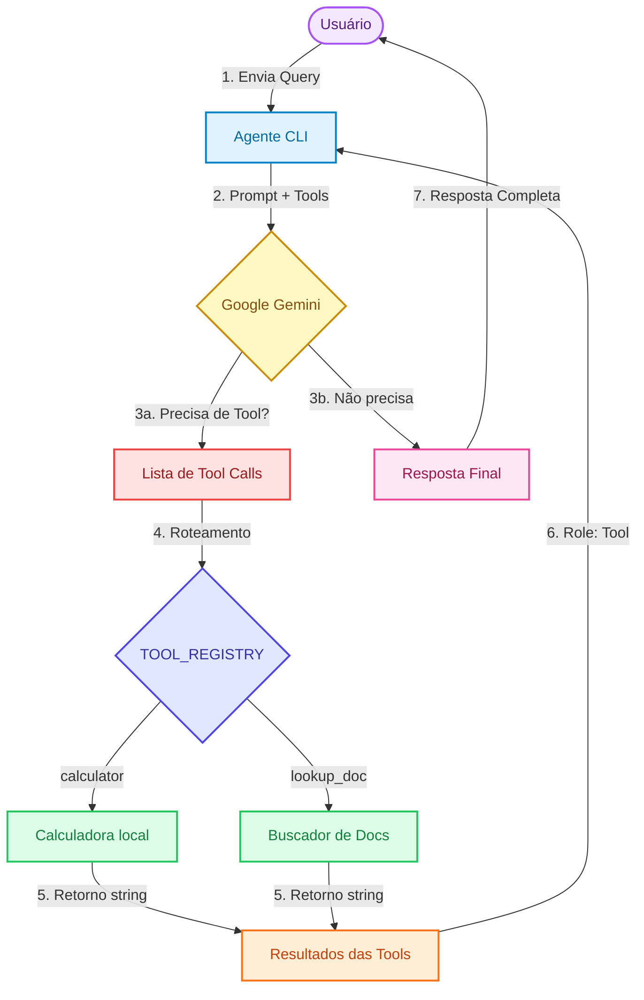
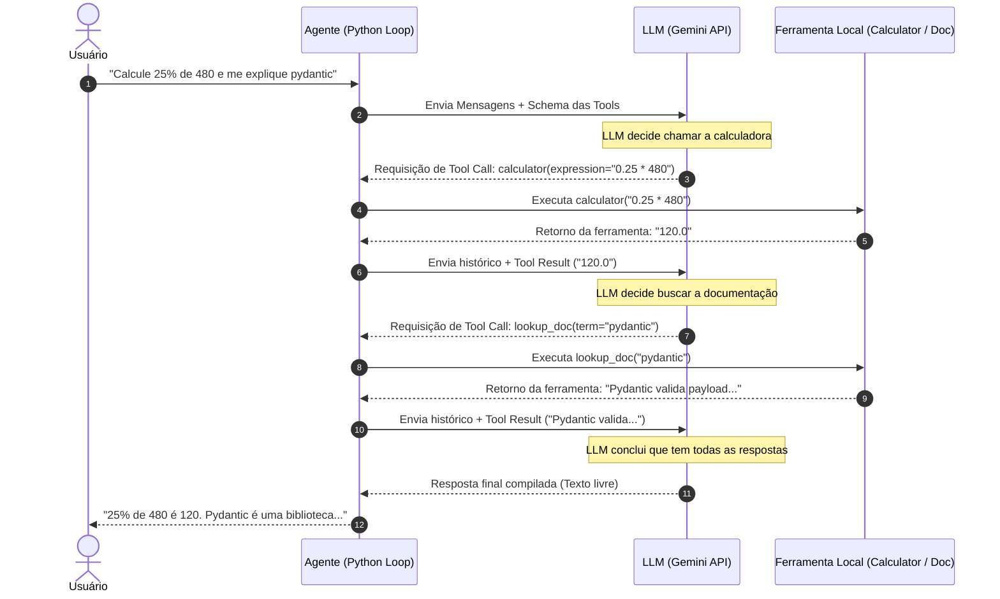

# 🧠 Desenvolvendo Software com IA Generativa (Mod4 / PPI)

Repositório dedicado aos laboratórios práticos e projetos desenvolvidos durante a disciplina ministrada pelo **Prof. Nicksson Freitas** no SiDi.

O foco da disciplina é o desenvolvimento de aplicações inteligentes utilizando LLMs como componentes de arquitetura, integrando pipelines de RAG (Retrieval-Augmented Generation), Function-Calling (Tool-Use), avaliações robustas com RAGAS e técnicas de otimização de custo/latência.

---

## 🛠️ Tecnologias Utilizadas

*   **Provedor de LLM:** Google Gemini API (`gemini-2.5-flash-lite`, `gemini-3.5-flash`)
*   **Orquestração & Clientes:** OpenAI SDK (endpoint compatível com Gemini)
*   **Validação de Dados:** Pydantic v2 (Structured Outputs)
*   **Interface Gráfica:** Streamlit
*   **Banco de Vetores:** ChromaDB
*   **Gerenciador de Dependências:** `uv` (ambiente virtual rápido)

---

## 📂 Laboratórios Desenvolvidos

### 🚀 [LAB-001 — Agent CLI Single-Turn com Tool-Use](labs/01-agent-cli-tool-use.ipynb)
Implementação de um agente inteligente executado via terminal capaz de tomar decisões autônomas e acionar ferramentas locais para resolver problemas complexos.

*   **Principais Implementações:**
    *   **Loop de Raciocínio (ReAct):** Loop robusto entre a LLM e execução física de código.
    *   **Ferramentas Seguras (Tool-Use):** Calculadora com Whitelist para prevenção de injeção de código (RCE) e buscador conceitual case-insensitive.
    *   **Schemas JSON (JSON Schema):** Estruturação das ferramentas no formato oficial compatível com OpenAI/Anthropic.
    *   **Debrief de Tradeoffs:** Estudo analítico das vantagens em exatidão matemática e ancoragem (Groundedness) contra custos e latência de rede.

---

## 🎨 Arquitetura do Loop do Agente (Fluxo Colorido)

Este fluxograma colorido ilustra como as requisições transitam entre o loop local de Python e a API de LLM durante o processamento das ferramentas:

---

## 🔄 Fluxo de Execução (Diagrama de Sequência)

Abaixo está representado o fluxo sequencial de execução do agente implementado no **LAB-001** ao responder a uma consulta de duas ferramentas combinadas:

---

## 🛡️ Organização do Repositório

Para manter o repositório limpo, focado e profissional para portfólio, apenas os arquivos essenciais de entrega são rastreados publicamente, enquanto o ambiente virtual (`.venv`), chaves de segurança (`.env`) e os PDFs brutos de slides e guias permanecem protegidos localmente.

---

*SiDi - Desenvolvimento de Software de IA @ 2026*
