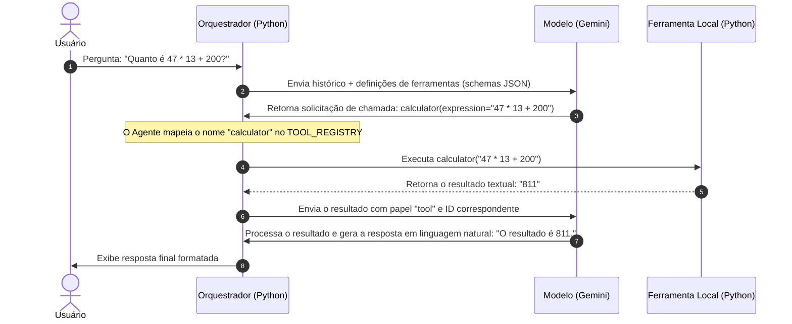

# Guia de Estudos: LAB-001 — Agent CLI Single-Turn com Tool-Use

Este guia detalha o funcionamento técnico, os conceitos fundamentais e as escolhas de design aplicadas no laboratório. Ele serve como roteiro de estudos para você dominar cada engrenagem do projeto.

---

## 1. O que é um Agente CLI Single-Turn com Tool-Use?

Para compreender a arquitetura proposta no laboratório, vamos destrinchar os três pilares desse conceito:

* **Agente (Agent):** Diferente de uma LLM clássica e passiva (que apenas responde com texto a um prompt estático), um agente é um sistema ativo. Ele é composto por:
  1. **O Cérebro (LLM):** Responsável por tomar as decisões lógicas de qual rumo seguir.
  2. **As Ferramentas (Tools):** Códigos executáveis na máquina local (como a nossa calculadora Python ou a busca no corpus).
  3. **O Orquestrador (Código Python):** O corpo do agente. É o loop em código que gerencia a conversa, chama as funções de fato e devolve os dados para a LLM.
* **CLI (Command Line Interface):** Indica o meio físico de execução. O agente roda a partir de entradas de linha de comando no terminal/console, exibindo logs estruturados em tempo real.
* **Single-Turn (Turno Único):** Representa uma divisão importante de perspectivas:
  * **Perspectiva do Usuário:** A interação é de **Turno Único**. O usuário envia uma única pergunta e recebe uma única resposta limpa e direta.
  * **Perspectiva do Sistema (Sob o capô):** A interação é de **Múltiplos Turnos**. O orquestrador realiza um loop iterativo ("conversa em segundo plano") alimentando a LLM com resultados sucessivos de ferramentas até que o modelo declare que possui os dados suficientes para encerrar o ciclo.

---

## 2. O que é Tool-Use (Function Calling)?

Tradicionalmente, Modelos de Linguagem (LLMs) geram texto de forma probabilística. Elas não conseguem calcular de forma confiável contas matemáticas complexas ou buscar dados privados que não estavam em sua base histórica de treinamento.

O **Tool-Use** resolve isso permitindo que a LLM delegue tarefas especializadas para códigos executáveis locais (Python):
* A LLM **não executa** o código Python diretamente.
* A LLM apenas **decide** qual função chamar e **quais argumentos** passar para ela, com base na pergunta do usuário.
* O orquestrador local (nosso código em Python) intercepta essa intenção, executa a função com os argumentos gerados pela LLM e devolve a resposta final para ela consolidar.

---

## 3. Fluxo de Vida do Agente (Sequence Diagram)

Aqui está como a conversa se desenvolve passo a passo em uma iteração típica do agente:



---

## 4. Componentes Estruturais do Código

### A. Schemas JSON (`TOOLS`)
Para que o Gemini conheça a existência de uma ferramenta e saiba como usá-la, descrevemos seus metadados no padrão JSON Schema. O campo `description` é essencial: a LLM lê essa descrição para decidir semanticamente se a ferramenta é adequada para a requisição.

### B. O Roteador (`TOOL_REGISTRY`)
Um dicionário Python simples que associa o nome da função (retornado pelo modelo em texto) com o ponteiro da função Python executável correspondente:
```python
TOOL_REGISTRY = {
    "calculator": calculator,
    "lookup_doc": lookup_doc
}
```
Isso permite a chamada dinâmica através de: `TOOL_REGISTRY[fn_name](**args)`.

### C. Segurança no `eval` (Sandboxing)
> [!WARNING]
> Chamar `eval()` cru em strings recebidas de LLMs é uma vulnerabilidade grave, pois a LLM pode sofrer injeção de prompt e gerar strings maliciosas que executam comandos no sistema operacional.
>
> Para mitigar isso no laboratório, aplicamos duas camadas de segurança:
> 1. **Whitelisting:** Filtramos a entrada permitindo apenas os caracteres `"0123456789+-*/(). "` (números, parênteses e operadores aritméticos básicos). Qualquer letra ou caractere fora do escopo aborta o cálculo.
> 2. **Desativação de Globais:** Executamos `eval` com `{"__builtins__": {}}` para isolar o escopo e impedir acesso a funções nativas perigosas como `__import__`.

---

## 5. Comparativo Direto de Tradeoffs

| Aspecto | Abordagem Pure-Prompt | Abordagem Tool-Use (Agente) |
| :--- | :--- | :--- |
| **Precisão Numérica** | Aritmética probabilística (sujeito a erros graves de arredondamento e dígitos). | Execução matemática precisa em código (100% determinística). |
| **Consistência Factual** | Baseado na memória estática do modelo (risco alto de alucinações). | Grounding (ancoragem) em fontes de verdade locais atualizadas (`DOCS`). |
| **Custo de Tokens** | Baixo (apenas 1 ciclo de ida e volta). | Elevado (requisições múltiplas para cada passo de ferramenta no loop). |
| **Latência** | Baixa e imediata. | Alta (acumula o tempo de múltiplos turnos de LLM + execução do código). |

---

## 6. Como funciona a Visualização HTML Premium?

Quando chamamos `display(HTML(html_content))` no notebook, o Jupyter intercepta e renderiza a saída em HTML estilizado.

* **Tipos de Painéis:**
  * `info` (Azul): Destaques de controle e etapas do lab.
  * `tool` (Verde): Chamadas de ferramenta disparadas pela LLM.
  * `result` (Laranja): Resultados calculados pelas ferramentas locais.
  * `final` (Roxo): A resposta sintetizada final.
  * `pure` (Amarelo): Respostas do comparativo direto de prompt puro.
* **Execução em Segundo Plano:** O script executor do projeto intercepta essas saídas nativamente em tempo de compilação, salvando-as diretamente no formato JSON estruturado do arquivo `.ipynb`. Isso permite que, ao abrir o notebook, todas as saídas já apareçam renderizadas em painéis elegantes.
